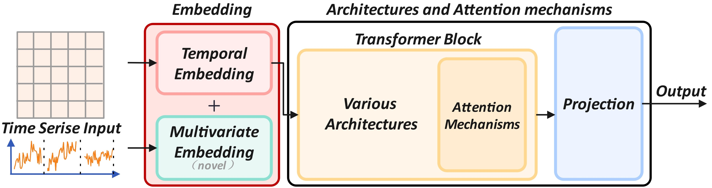
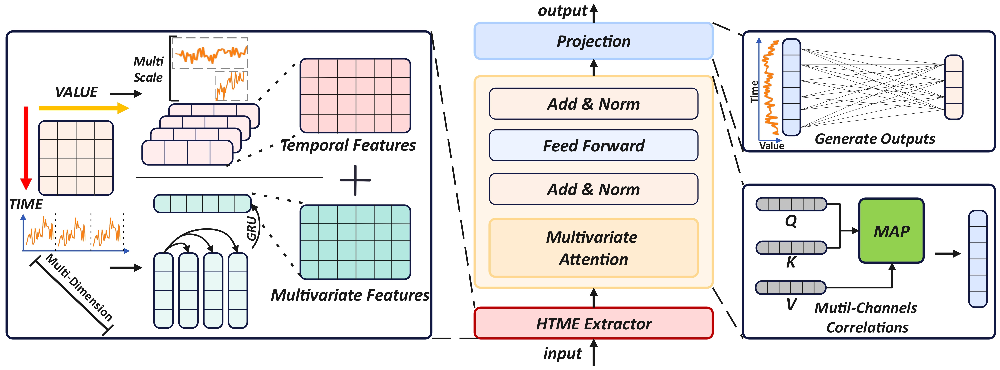
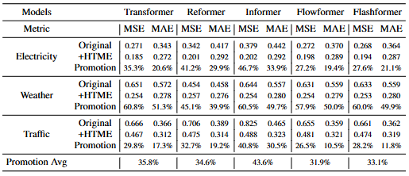
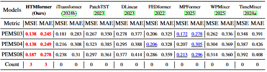
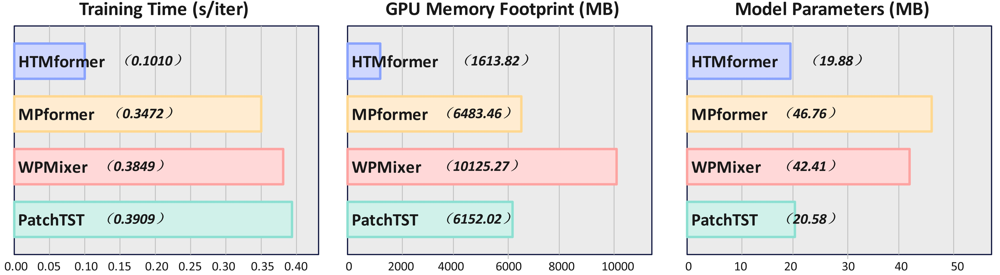

# HTMformer
This paper introduces Hybrid Temporal and Multivariate Embeddings (HTME) strategy. By combining HTME with the Transformer architecture, we present HTMformer. 
## Updates

## Introduction
This paper proposes to jointly capture temporal and multivariate features in the embedding layer, thereby yielding semantically rich embedding representations to overcome the inherent limitations of the conventional embedding strategy. 

Extensive empirical evaluations are conducted on eight real-world benchmarks spanning application domains.
Notably, HTMformer consistently achieves state-of-the-art performance across various benchmarks. 

<p align="center">
  
</p>

## Overall Architecture
The model includes an HTME extractor, a vanilla Transformer encoder layer, and a projection layer. 


## Usage

1. Install Pytorch and the necessary dependencies.

```
pip install -r requirements.txt
```

2. The datasets can be obtained from our paper.

3. Train and evaluate the model. The detailed experiment settings are provided in our paper. You can run HTMformer as following:
```
python run.py
```
## Main results of experiments
to evaluate the effectiveness of the proposed HTME strategy. We conducted extensive experiments on eight real-world benchmarks.
### Performance of HTME strategy
To assess the effectiveness and scalability of HTME, it is integrated into the Transformer and its variants.
<p align="center">
  
</p>

### Long-term forecasting tasks
We conduct a comprehensive evaluation of the effectiveness of HTMformer in long-term forecasting. HTMformer outperforms various baselines (Avg Results). 
<p align="center">
  
</p>

### Short-term forecasting tasks
The experimental results on the PEMS (PEMS03, PEMS04, and PEMS08) datasets.
The proposed HTMformer demonstrates better performance across all three PEMS datasets.
<p align="center">
  
</p>

### Model Efficiency
To assess the computational efficiency of HTMformer, we perform a comparative analysis of its training time, GPU memory footprint, and parameter count against state-of-the-art models.
<p align="center">
  
</p>

## Acknowledgement


