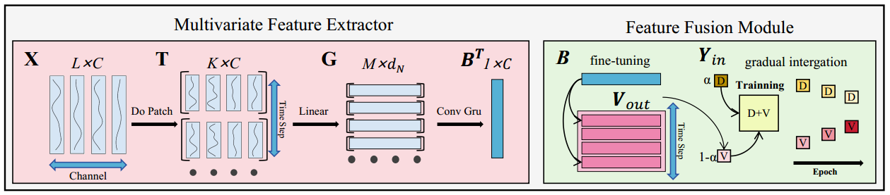
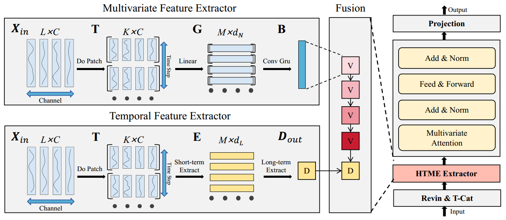
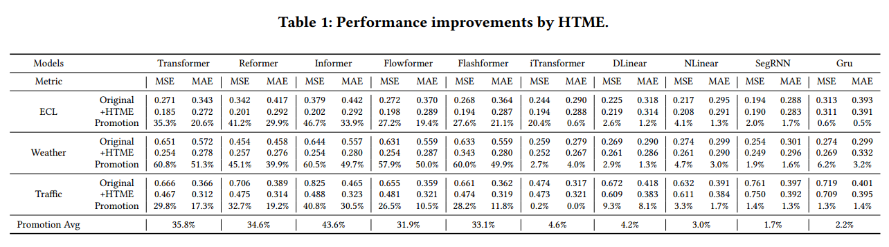

# HTMformer
This paper introduces Hybrid Temporal and Multivariate Embeddings (HTME) strategy. The contributions of this work are as follows:
1. We propose the Hybrid Temporal and Multivariate Embedding (HTME) strategy. It enables predictors to more effectively leverage reliable multivariate features, while introducing only minimal computational overhead
2. We introduce a novel forecasting framework, HTMformers, which consistently improves the performance of attention mechanisms in forecasting. The representation HTMformer consistently achieves state-of-the-art performance.
3. We select five widely-used forecasting models and develop their HTME versions. Extensive experiments demonstrate that HTME consistently enhances the ability of diverse architectures to model complex time series
## Updates

## HTME
This paper proposes to jointly capture temporal and multivariate features in the embedding layer, thereby yielding semantically rich embedding representations to overcome the inherent limitations of the CD strategy. 


## HTMEformer
The model includes an HTME extractor, a vanilla Transformer encoder layer, and a projection layer. 


## Usage

1. Install Pytorch and the necessary dependencies.

```
pip install -r requirements.txt
```

2. The datasets can be obtained from our paper.

3. Train and evaluate the model. The detailed experiment settings are provided in our paper. You can run HTMformer as following:
```
python run.py
```
## Main results of experiments
to evaluate the effectiveness of the proposed HTME strategy. We conducted extensive experiments on eight real-world benchmarks.
### Performance of HTME strategy
To assess the effectiveness and scalability of HTME, it is integrated into the different models.
<p align="center">
  
</p>

### Model Efficiency
To assess the computational efficiency of HTMformer, we perform a comparative analysis of its training time, GPU memory footprint, and parameter count against state-of-the-art models.
<p align="center">
  
</p>

## Acknowledgement


