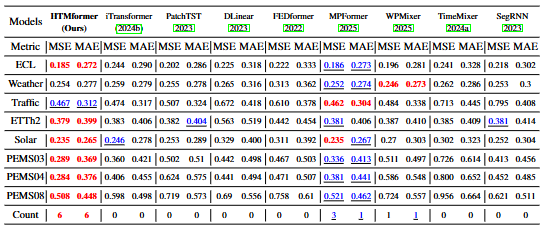

# HTME
This paper introduces Hybrid Temporal and Multivariate Embeddings (HTME) strategy. The contributions of this work are as follows:
1. We propose the Hybrid Temporal and Multivariate Embedding (HTME) strategy. It enables predictors to more effectively leverage reliable multivariate features, while introducing only minimal computational overhead
2. We introduce a novel forecasting framework, HTMformers, which consistently improves the performance of attention mechanisms in forecasting. The representation HTMformer consistently achieves state-of-the-art performance.
3. We select five widely-used forecasting models and develop their HTME versions. Extensive experiments demonstrate that HTME consistently enhances the ability of diverse architectures to model complex time series

## Updates

## HTME
HTME separates a dedicated multivariate feature space for pattern extraction and denoising and then gradually maps the extracted features to the feature space, yielding multidimensional embeddings that convey richer and more reliable sequence representations. 


## HTMEformer
The model includes an HTME extractor, a vanilla Transformer encoder layer, and a projection layer. 


## Usage

1. Install Pytorch and the necessary dependencies.

```
pip install -r requirements.txt
```

2. The datasets can be obtained from our paper.

3. Train and evaluate the model. The detailed experiment settings are provided in our paper. You can run HTMformer as following:
```
python run.py
```
## Main results of experiments
to evaluate the effectiveness of the proposed HTME strategy. We conducted extensive experiments on eight real-world benchmarks.
### Performance of HTME strategy
To assess the effectiveness and scalability of HTME, it is integrated into the different models.
<p align="center">
  
</p>

### Long and Short term forecasting results
We further compare HTMformer, which adopts the Full-Attention mechanism and serves as a representative of HTMPredictors, with recent state-of-the-art methods
<p align="center">
  
</p>

<p align="center">
  
</p>

### Model Efficiency
The time and space complexities of the multivariate feature extraction module are both $O~(LC)$. For each dimension, the computational complexity is linear, which guarantees high efficiency and scalability of HTME. 
Owing to its carefully designed architecture, the computational overhead introduced by the HTME modul
HTME incurs an additional 2 seconds of computation time and introduces 550K parameters on the ELC dataset.
<p align="center">
  
</p>

## Acknowledgement


